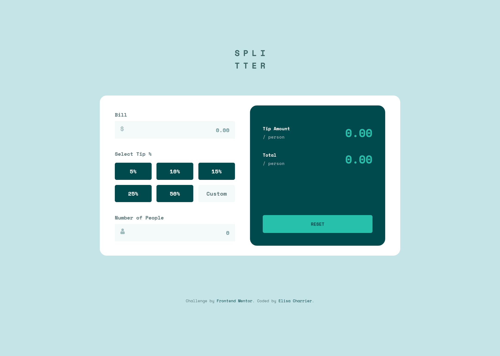
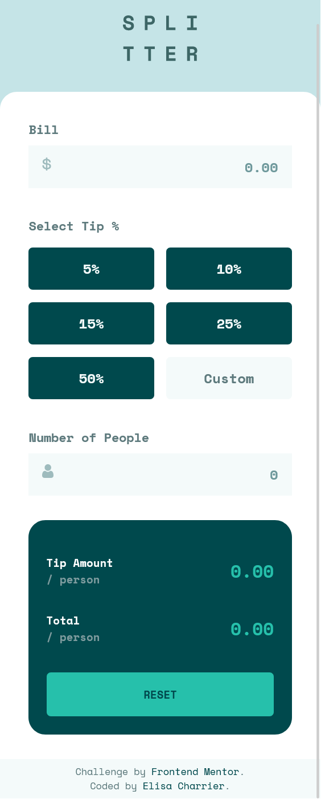

# Frontend Mentor - Tip calculator app solution

This is a solution to the [Tip calculator app challenge on Frontend Mentor](https://www.frontendmentor.io/challenges/tip-calculator-app-ugJNGbJUX). Frontend Mentor challenges help you improve your coding skills by building realistic projects.

## Table of contents

- [Frontend Mentor - Tip calculator app solution](#frontend-mentor---tip-calculator-app-solution)
  - [Table of contents](#table-of-contents)
  - [Overview](#overview)
    - [The challenge](#the-challenge)
    - [Screenshot](#screenshot)
    - [Links](#links)
  - [My process](#my-process)
    - [Built with](#built-with)
    - [What I learned](#what-i-learned)
    - [Continued development](#continued-development)
    - [Useful resources](#useful-resources)
  - [Author](#author)

## Overview

### The challenge

Users should be able to:

- View the optimal layout for the app depending on their device's screen size
- See hover states for all interactive elements on the page
- Calculate the correct tip and total cost of the bill per person

### Screenshot

### Links

- Solution URL: [https://github.com/elisa-charrier/tip-calculator-app](https://github.com/elisa-charrier/tip-calculator-app)
- Live Site URL: [https://elisa-charrier.github.io/tip-calculator-app/](https://elisa-charrier.github.io/tip-calculator-app/)

## My process

### Built with

- Semantic HTML5 markup
- Responsive design
- CSS Grid
- Mobile-first workflow
- SASS
- Javascript 
- HTML DOM API

### What I learned

This was my first challenge using Javascript in a website. I improved my knoledge about Document interface and Javascript event listeners.
Also, I tried to keep an eye on acessibility.  

### Continued development

My next step will be trying to better organise CSS in order to easly modify and reuse colors, typography, spacing and other variables. Stay tuned to see the next project!

### Useful resources

- [WAVE Web Accessibility Evaluation Tool](https://wave.webaim.org/) - This free suite helped me to check accessibility issues of my website.

## Author

- Github - [elisa-charrier](https://github.com/elisa-charrier)
- Frontend Mentor - [@elisa-charrier](https://www.frontendmentor.io/profile/elisa-charrier)
